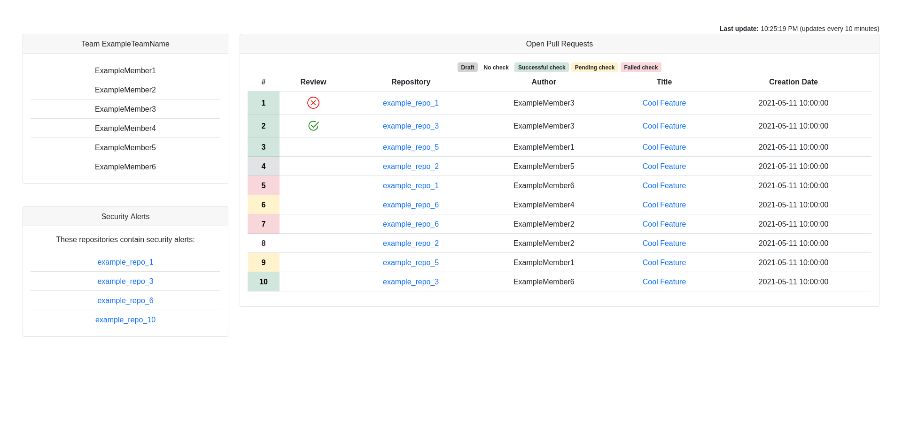

# GitHub Team Dashboard

Whether it is in your laptop or in a big screen, _GitHub Team Dashboard_ will allow you to comfortably visualize
useful information related to your GitHub team.

Example screenshot:

## Running the application

In order to use this application you need to generate a GitHub personal access token in
GitHub's settings menu, under _Developer settings_. The token requires these permissions:

* All permissions under _repo_ including itself.
* _read:org_

Make sure you store this token somewhere, as you can only see it once.

By default, the application will run in port 8080. If you want it to run on a different port, set the environment
variable _MICRONAUT_SERVER_PORT_ to a different port.

### Docker

You can find all available docker images here: [GitHub Container Registry](https://github.com/users/xalvarez/packages/container/package/github-team-dashboard)

Copy a docker image tag and start a container as follows:

    docker run -d -p 8080:8080 \
        -e GITHUB_DASHBOARD_TOKEN=<your_token> \
        -e GITHUB_DASHBOARD_TEAM=<your_team> \
        -e GITHUB_DASHBOARD_ORGANIZATION=<your_org> \
        --name github-team-dashboard \
        <docker_image_tag>
        
E.g.:

    docker run -d -p 8080:8080 \
        -e GITHUB_DASHBOARD_TOKEN=<your_token> \
        -e GITHUB_DASHBOARD_TEAM=<your_team> \
        -e GITHUB_DASHBOARD_ORGANIZATION=<your_org> \
        --name github-team-dashboard \
        ghcr.io/xalvarez/github-team-dashboard:3.2.2

The application will then be available under [http://localhost:8080](http://localhost:8080).

### Gradle

**Important: The application requires JDK 15 to run.** 

Before starting your application you need to set the following environment variables:

    GITHUB_DASHBOARD_ORGANIZATION=<your github organization>
    GITHUB_DASHBOARD_TEAM=<your github team within that organization>
    GITHUB_DASHBOARD_TOKEN=<your personal access token>

After setting the environment variables above you can start the application as follows:

    ./gradlew run

Thanks to incremental annotation processing, startup time will improve significantly the next time you run the command
above.

Once the application starts you'll find it under [http://localhost:8080](http://localhost:8080).
If you want it to run on a different port, set the environment variable _MICRONAUT_SERVER_PORT_ to a different port
before starting the application, e.g.:

    export MICRONAUT_SERVER_PORT=10000
    
#### Watching for changes

If you want the application to restart automatically after modifying code you should start it as
like this:

    ./gradlew run --continuous

### Health endpoint

The application exposes a `/health` endpoint which you can use to see if it's running.

## Running tests

The following command runs all checks:

    ./gradlew check

## Contributing to GitHub Team Dashboard

Should you want to contribute to **GitHub Team Dashboard** please have a look at
[CONTRIBUTING.md](CONTRIBUTING.md).
